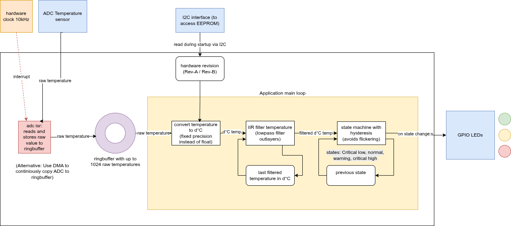
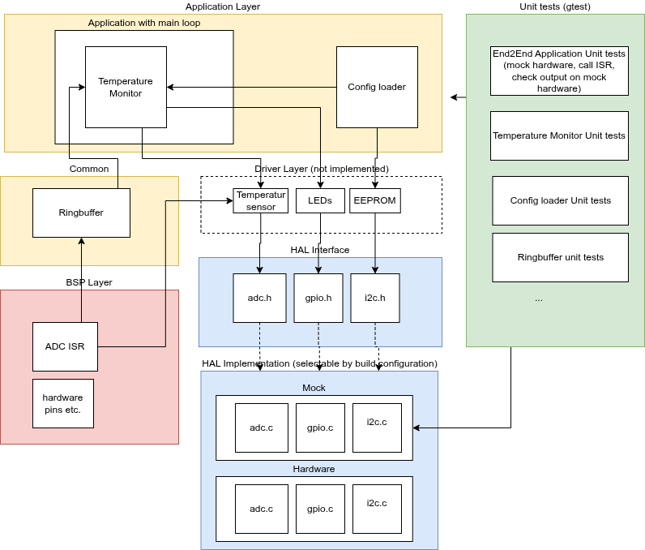

# Baremetal ADC-Triggered LED Control Simulation

This project implements a PC-based simulation of a bare-metal temperature monitoring system.

## Features

- Simulated ADC sampling at approximately 10 kHz via ISR thread
- Lock-free single-producer single-consumer ringbuffer
- 100 Hz main loop processing
- Temperature conversion for two hardware revisions:
  - Rev-A: 1 digit = 1°C
  - Rev-B: 0.1°C per digit
- IIR filtering of temperature samples
- Hysteresis-based LED state machine for OK / Warning / Critical
- Configuration loading for hardware revision and serial number


## Dataflow diagram



## Architecture diagram



## Build

From the repository root, build with the mock HAL implementation (default):

```sh
make
```

Or explicitly specify the HAL implementation:

```sh
# Build with mock HAL (PC simulation)
make HAL_IMPL=mock

# Build with hardware HAL (bare-metal target)
make HAL_IMPL=hw
```

For more options:

```sh
make help
```
## Running the mock application

After `make`, the mock-application can be executed using

`SIM_HW_REV=B ./simulated_temperature_monitor`
or
`SIM_HW_REV=B ./simulated_temperature_monitor`
depending on the needed hardware revision.

## Testing

The project uses Google Test for unit testing of application logic.

```sh
make test
```

This will:
- Download and build Google Test automatically
- Compile and run tests for temperature monitoring logic
- Compile and run tests for configuration loading
- All HAL implementations are mocked during testing

## Project Structure

- `project/main.c` - application entry and simulation orchestration
- `project/app/` - application logic
  - `application.h/c` - the main application loop and component orchestration
  - `config_loader.h/c` - configuration loading from I2C EEPROM
  - `temp_monitor.h/c` - temperature monitoring and LED control logic
- `project/hal/` - Hardware Abstraction Layer
  - `*.h` - platform-independent HAL interfaces
  - `mock/` - mock implementations for PC simulation
  - `hw/` - hardware placeholder implementations for bare-metal targets
- `project/bsp/` - ISR simulation thread
- `project/common/` - lock-free ringbuffer implementation
- `tests/` - Google Test suite for application logic testing

## Hardware Abstraction Layer (HAL)

The HAL provides a clean, platform-independent interface for hardware operations:

### Interfaces
- `adc.h` - ADC sampling and initialization
- `gpio.h` - LED control (GREEN, YELLOW, RED)
- `i2c.h` - I2C communication protocol

### Implementations

**Mock Implementation** (`hal/mock/`)
- Used in PC simulation mode (default)
- Simulates sensors with realistic data patterns
- Provides debug output for testing

**Hardware Implementation** (`hal/hw/`)
- Placeholder for bare-metal targets
- Ready for real hardware drivers
- Use with `make HAL_IMPL=hw`

### Design

The application depends only on HAL interfaces (`.h` files), not implementation details. This allows seamless switching between mock and hardware implementations at compile time via the `HAL_IMPL` flag.


## Notes

- The ISR thread is intentionally minimal: it only reads the ADC and pushes to the ringbuffer.
- The main thread handles filtering, state transitions, and LED updates.
- Application code is completely decoupled from HAL implementation details.
- Mock implementation provides realistic sensor simulation for PC testing.
- Hardware implementation is ready for expansion with real device drivers.
